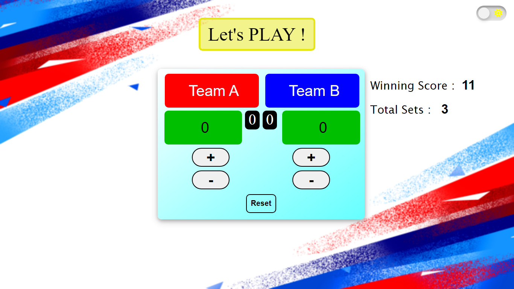
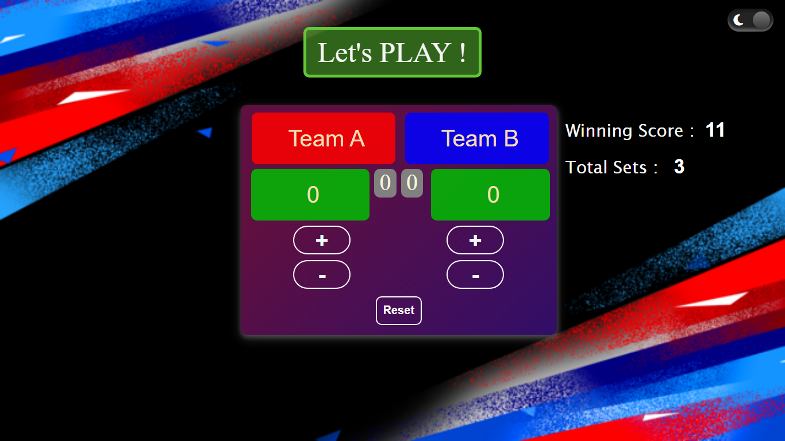

# Score Board

[](https://score-board-lets-play.netlify.app/)

## Introduction

Score Board is a web application that allows users to keep track of scores for various activities or competitions. Whether it's a friendly game night, a sports event, or any other contest, Score Board provides an easy and efficient way to manage and display scores in real-time.

## Features

- Add Participants: For each scoreboard, users can add participants or teams competing in the activity. (For initial stage it is limited upto two teams only)

- Update Scores: Score Board allows users to update scores for each participant or team as the activity progresses.

- Reset Scoreboard: Reset the scoreboard after each set by clicking on 'Reset' button. Complete reset is done after any of the teams,players or participants win by clicking on 'Game Reset' button.

- Real-time Updates: The scores are updated in real-time, allowing all participants and viewers to see the latest results.

- Customization: Users can customize the appearance of the scoreboards to match the theme of the event.

- Celebrations: The winning team or participant is displayed with celebration for winning the game.

- Interactive audio for each event.

- **DARK MODE :** Now you can toggle between dark and light mode using the button provided on top right corner.



## How to Use

1. Clone the repository to your local machine.

```bash
git clone https://github.com/Flames004/Score-Board.git
cd score-board
```

2. Install VS Code
```text
https://code.visualstudio.com/download
```

3. Open folder in VS Code (for windows)

```bash
code .
```

4. Open the application in your web browser.

```text
index.html
```

5. Add Participants or Teams.

- Add the names of both teams or participants under each score cell.

6. Add number of sets.

- Change the number of sets required for the game to win.

7. Add winning score.

- Change the score required for the team to win the set.

8. Update scores.

- As the activity make progress, click on the increase or decrease buttons to update the scores.

9. Automatically sets update.

- As the game progress with each sets, they get updated automatically with respect of each team, player or participant.

10. Reset scoreboard.

- Reset the scoreboard after each set and game by clicking on 'Reset' or 'Game Reset' button.

## Upcoming Features

- Create Scoreboards: Users can create multiple scoreboards for different activities or events.

- Leaderboard: Score Board automatically generates a leaderboard based on the scores, displaying the top participants or teams.

## Contributions and Issues

Contributions to the project are welcome! If you find any issues or have suggestions for improvements, feel free to open a new issue in the [GitHub repository](https://github.com/Flames004/Score-Board/issues).

## License

This project is licensed under the [MIT License](LICENSE).

## Contact

For any questions or inquiries, please contact [deepakshukla2442@gmail.com](mailto:deepakshukla2442@gmail.com).

---
